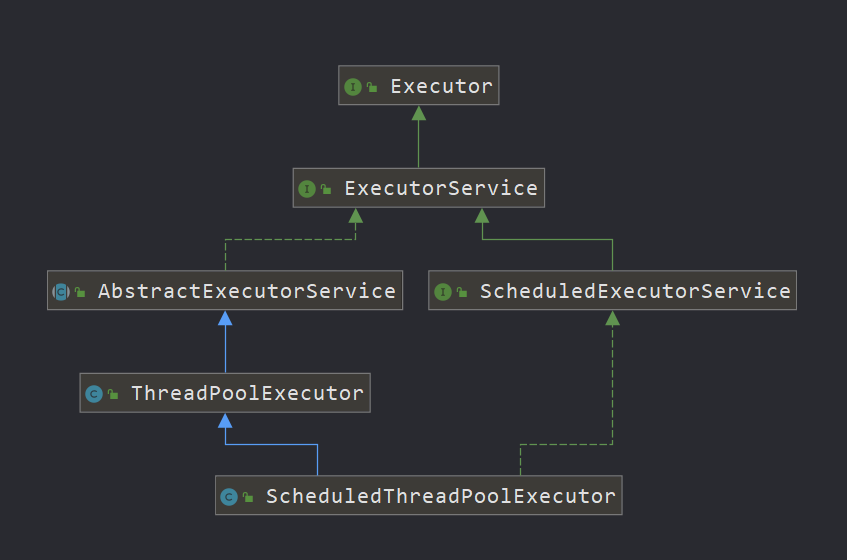

### ScheduledThreadPoolExecutor

说明：特殊的线程池，在普通线程池上加上了定时功能，所以和线程池的底层模型是一样的。

> ScheduledThreadPoolExecutor继承图




> 基本使用案例

```java
ScheduledThreadPoolExecutor executor = new ScheduledThreadPoolExecutor(1);

// 多久后执行，只会执行一次
executor.schedule(() -> {
    System.out.println("一秒后执行");
},1, TimeUnit.SECONDS);

// 多久后开始执行，每n秒执行一次（同一线程）
executor.scheduleAtFixedRate(() -> {
    System.out.println("send heart");
},1000, 2000,TimeUnit.MILLISECONDS);


// 多久后开始执行，代码块执行完，n秒后再次执行（同一线程）
executor.scheduleWithFixedDelay(() -> {
    System.out.println("send heart");
    try {
        Thread.sleep(3000);
    } catch (InterruptedException e) {
        e.printStackTrace();
    }
},1000,2000,TimeUnit.MILLISECONDS);
```


> 为何阿里推荐我们使用ScheduledThreadPoolExecutor，不推荐使用Timer?

我们可以从源码入手

Timer

```java
public class Timer {
    /**
     * The timer task queue.  This data structure is shared with the timer
     * thread.  The timer produces tasks, via its various schedule calls,
     * and the timer thread consumes, executing timer tasks as appropriate,
     * and removing them from the queue when they're obsolete.
     */
    private final TaskQueue queue = new TaskQueue();

    /**
     * The timer thread.
     */
    private final TimerThread thread = new TimerThread(queue);
```

实际上，Timer执行任务的时候是内部维护的线程去执行，而当出现异常的时候，线程就会被终止，也就不能够在去执行下一个任务了。而线程池当遇到异常的时候，异常线程会被终止，但是当有新的任务进来的时候，又会重新开启一个新线程去执行任务。

总结：ScheduledThreadPoolExecutor在遇到异常的时候不会导致程序终止退出，而Timer遇到异常是，会直接导致程序终止，这是在生产上面不想看到的。


> ScheduledThreadPoolExecutor源码分析，以scheduleAtFixedRate为例


```java
public ScheduledFuture<?> scheduleAtFixedRate(Runnable command,
                                              long initialDelay,
                                              long period,
                                              TimeUnit unit) {
    if (command == null || unit == null)
        throw new NullPointerException();
    if (period <= 0)
        throw new IllegalArgumentException();
   // 创建一个调度任务
    ScheduledFutureTask<Void> sft =
        new ScheduledFutureTask<Void>(command,
                                      null,
                                      triggerTime(initialDelay, unit),
                                      unit.toNanos(period));
    // 预留拓展 返回还是原先的任务
    RunnableScheduledFuture<Void> t = decorateTask(command, sft);
    // 将自己赋值给成员变量，方便后续反复执行
    sft.outerTask = t;
    // 执行
    delayedExecute(t);
    return t;
}


private void delayedExecute(RunnableScheduledFuture<?> task) {
    // 判断一下是否中断
    if (isShutdown())
        // 拒绝任务
        reject(task);
    else {
        // 直接加入队列
        super.getQueue().add(task);
        // 再次判断是否中断
        if (isShutdown() &&
            !canRunInCurrentRunState(task.isPeriodic()) &&
            remove(task))
            task.cancel(false);
        else
            // 创建线程工作
            ensurePrestart();
    }
}

void ensurePrestart() {
    int wc = workerCountOf(ctl.get());
    if (wc < corePoolSize)
        addWorker(null, true);
    else if (wc == 0)
        addWorker(null, false);
}

// 创建工作线程后，实际是调用run方法
public void run() {
    // 判断是否周期执行
    boolean periodic = isPeriodic();
    if (!canRunInCurrentRunState(periodic))
        cancel(false);
    // 不是周期性任务，直接执行run
    else if (!periodic)
        ScheduledFutureTask.super.run();
    // 如果是的话执行任务
    else if (ScheduledFutureTask.super.runAndReset()) {
        // 设置下一次执行的时间
        setNextRunTime();
        // 周期性执行，将当前任务传入
        reExecutePeriodic(outerTask);
    }
}

void reExecutePeriodic(RunnableScheduledFuture<?> task) {
    if (canRunInCurrentRunState(true)) {
        // 重新入队
        super.getQueue().add(task);
        if (!canRunInCurrentRunState(true) && remove(task))
            task.cancel(false);
        else
            // 开干
            ensurePrestart();
    }
}
```


> 定时线程池使用的是DelayedWorkQueue

DelayedWorkQueue的逻辑数据结构是heap，底层存储结构是数组。该队列会保证执行任务的顺序，离当前时间最小的任务先执行。


